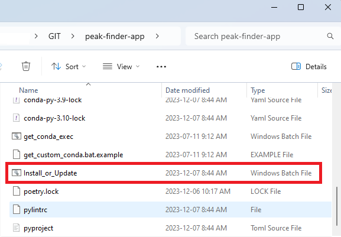

.. _getting_started:

Getting started
===============

Peak-finder is written on top of the `Geoh5py <https://github.com/MiraGeoscience/geoh5py>`_ library and
uses `Dash and Plotly <https://dash.plotly.com/>`_ to render ui and associated reactive plotting
components.

Thankfully, we have `poetry <https://python-poetry.org/>`_ and `conda <https://www.anaconda.com/>`_ to
solve dependencies and install the aforementioned packages within a virtual environment.  What does this
mean for the user?  Simply download anaconda (or one of it's counterparts) and double click on the
*Install_or_Update* batch file located in peak-finder's root directory and we'll do the rest.

.. _target to image:

While peak-finder may still be used through the geoapps jupyter notebook interface.  Those with a Pro
license of `Geoscience ANALYST <https://www.mirageoscience.com/mining-industry-software/geoscience-analyst-pro/>`_
will find a much more seemless experience through Geoscience ANALYST and *ui.json* files.