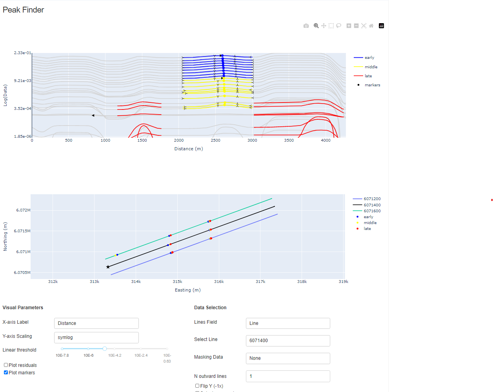

.. _introduction:

About
=====

Peak-finder has been designed for the detection and grouping of time-domain
electromagnetic (TEM) anomalies measured along flight lines. Anomaly markers
can be exported to `Geoscience ANALYST <https://www.mirageoscience.com/mining-industry-software/geoscience-analyst/>`_,
along with various metrics for characterization and targeting.

* Amplitude
* Dip direction
* Mad Tau (TEM data only)
* Anomaly skewness

While initially designed for TEM data, the same application can be used for
characterization of anomalies of mixed data types (eg. magnetics, gravity,
topography, etc..).

New user? Visit the :ref:`getting_started` page.

